<!--
  flag{read_the_source_before_you_trust_the_interface}
  Profile content refreshed: 2026-07-28
-->

<div align="center">
  <a href="https://isiraadithya.com/">
    
  </a>
</div>

<div align="center">
  <a href="https://github.com/DenverCoder1/readme-typing-svg">
    
  </a>
</div>

<p align="center">
  <a href="https://isiraadithya.com/"></a>
  <a href="https://app.intigriti.com/profile/isira_adithya"></a>
  <a href="https://hackerone.com/isira_adithya"></a>
  <a href="https://www.linkedin.com/in/isiraadithya/"></a>
  <a href="https://x.com/isira_adithya"></a>
</p>

<p align="center">
  
  
  
  
</p>

## `$ whoami`

```console
isira@research:~$ cat profile.json
{
  "role":       "Cyber Security Researcher / Ethical Hacker",
  "specialty":  ["Web Security", "API Security", "Offensive Security"],
  "method":     "discover → map → test → validate → report → retest",
  "education":  "BSc (Hons) Computer Security · First Class Honours",
  "base":       "Sri Lanka",
  "principle":  "Break assumptions. Document impact. Help teams fix it."
}
```

I research modern web and API attack surfaces through **authorized bug bounty programs**, **focused penetration tests**, source review, and security tooling. My work is strongest around authorization boundaries, identity and session behavior, browser trust, multi-tenant isolation, and business-logic failures.

I graduated with **First Class Honours in Computer Security**, earning a University of Plymouth degree through NSBM and finishing at the top of my batch. I now spend most of my time finding reproducible security flaws, writing clear reports, retesting fixes, and turning repeated techniques into automation.

<p align="center">
  
</p>

## `security.footprint`

My public Intigriti profile currently records **663 submissions**, **419 accepted reports**, a **98% validity rate**, and an **all-time rank of #12**.  
Security research is often private by design. Client names, unreleased findings, exploit details, and active program data are intentionally omitted unless already public and appropriate to reference.

## `stack.current`

<p align="center">
  
</p>

<p align="center">
  
  
  
  
  
  
</p>

**Daily environment:** Windows 11 + WSL2, Ubuntu VPS infrastructure, Burp Suite Professional, Python 3, Go, Node.js, Docker, PostgreSQL, Redis, and ProjectDiscovery tooling.

## `publications.and_talks`

- **2026 · IEEE / SCSE:** [XSSpecter: An Automated Framework for End-to-End Blind XSS Detection and Reporting](https://doi.org/10.1109/SCSE70081.2026.11499908)
- **2026 · SecurityWeek:** [Hacker Conversations: Isira Adithya, The Evolution of an Ethical Hacker](https://www.securityweek.com/hacker-conversations-isira-adithya-the-evolution-of-an-ethical-hacker/)
- **2026 · Intigriti:** [First guest in the Hacker Spotlight series](https://www.intigriti.com/researchers/blog/bug-bytes/intigriti-bug-bytes-232-january-2026)
- **2025 · NSBM TechSpire:** [Guest speaker on ethical hacking and security research](https://www.nsbm.ac.lk/techspire-2025-celebrates-excellence-at-nsbm-faculty-of-computing/)
- **Ongoing:** Security writeups and research notes at [blog.isiraadithya.com](https://blog.isiraadithya.com/)

## `responsible.disclosure`

All security work referenced here is performed with explicit authorization, within applicable program rules or a defined client scope. Tools in my repositories are intended for legal security testing, defensive research, education, and responsible disclosure.

<p align="center">
  <a href="https://isiraadithya.com/contact"><strong>Private security inquiry</strong></a>
  &nbsp;·&nbsp;
  <a href="https://blog.isiraadithya.com/"><strong>Research notes</strong></a>
  &nbsp;·&nbsp;
  <a href="https://github.com/isira-adithya?tab=repositories"><strong>Public repositories</strong></a>
</p>

<p align="center">
  
</p>
